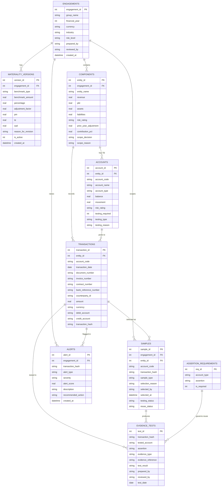

# AuditScope — 数据模型 (ERD)

**数据库:** SQLite (V1) → PostgreSQL (V3)
所有金额以最小货币单位的小数存储;所有表带 `created_at`。`transaction_hash` 是贯穿抽样、证据、预警的**业务主键**。

---

## ERD 关系图

---

## 核心表定义

### 1. engagements — 审计项目
项目入口,隔离多集团数据。

| 字段 | 类型 | 说明 |
|---|---|---|
| engagement_id | INTEGER PK | |
| group_name | TEXT | 集团名,如 ABC Holdings Ltd |
| financial_year | INTEGER | 财年,如 2026 |
| currency | TEXT | 记账币种 |
| industry | TEXT | 行业 |
| risk_level | TEXT | Low / Medium / High |
| prepared_by / reviewed_by | TEXT | 编制/复核人 |
| created_at | DATETIME | |

### 2. materiality_versions — 重要性版本(可修订)
每次重算落一行,`is_active=1` 为当前生效版本。

| 字段 | 类型 | 说明 |
|---|---|---|
| version_id | INTEGER PK | |
| engagement_id | INTEGER FK | |
| benchmark_type | TEXT | PBT / Revenue / Assets / Equity |
| benchmark_amount | REAL | |
| percentage | REAL | 基准百分比 |
| adjustment_factor | REAL | 调整系数 |
| pm / te / sad | REAL | 计算结果 |
| reason_for_revision | TEXT | 如 "After audit adjustment" |
| is_active | INTEGER | 是否当前生效 |
| created_at | DATETIME | |

### 3. components — 集团主体(附范围决策)

| 字段 | 类型 | 说明 |
|---|---|---|
| entity_id | INTEGER PK | |
| engagement_id | INTEGER FK | |
| entity_name | TEXT | |
| revenue / pbt / assets / liabilities | REAL | 主体财务 |
| risk_rating | TEXT | Low / Medium / High |
| prior_year_adjustment | REAL | 上年调整 |
| contribution_pct | REAL | 引擎回写:贡献度 |
| scope_decision | TEXT | Full / Specific / Analytical / Out |
| scope_reason | TEXT | 引擎回写:决策理由 |

### 4. accounts — 科目余额 TB(附测试决策)

| 字段 | 类型 | 说明 |
|---|---|---|
| account_id | INTEGER PK | |
| entity_id | INTEGER FK | |
| account_code / account_name | TEXT | |
| account_type | TEXT | Revenue / Asset / Liability / Expense / Equity |
| balance / movement | REAL | 余额 / 变动 |
| risk_rating | TEXT | |
| testing_required | INTEGER | 引擎回写 0/1 |
| testing_type | TEXT | Target+NSS / NSS / Specific / None |
| testing_reason | TEXT | 引擎回写理由 |

### 5. transactions — 交易明细(核心)
`transaction_hash` 由 Module 6 生成,是跨表业务键。

| 字段 | 类型 | 说明 |
|---|---|---|
| transaction_id | INTEGER PK | 行级技术键 |
| entity_id | INTEGER FK | |
| account_code | TEXT | |
| transaction_date | DATE | |
| document_number | TEXT | 凭证号 |
| invoice_number | TEXT | 发票号 |
| contract_number | TEXT | 合同号 |
| bank_reference_number | TEXT | 银行流水号 |
| counterparty_id | TEXT | 对手方 |
| amount | REAL | |
| currency | TEXT | |
| debit_account / credit_account | TEXT | 借/贷科目 |
| transaction_hash | TEXT | 唯一交易 ID(业务键) |

### 6. samples — 抽样结果

| 字段 | 类型 | 说明 |
|---|---|---|
| sample_id | INTEGER PK | |
| engagement_id / entity_id | INTEGER FK | |
| account_code | TEXT | |
| transaction_hash | TEXT | 指向被抽交易 |
| sample_type | TEXT | Target / NSS / Reuse Candidate |
| selection_reason | TEXT | 抽中理由 |
| selected_by | TEXT | |
| selected_at | DATETIME | |
| testing_status | TEXT | Not tested / Tested |
| reuse_status | TEXT | Reusable / Partially / Not / — |

### 7. evidence_tests — 测试证据(复用判断依据)
同一 hash 可有多行(不同科目 / 不同 assertion)。

| 字段 | 类型 | 说明 |
|---|---|---|
| test_id | INTEGER PK | |
| transaction_hash | TEXT | |
| tested_account | TEXT | 在哪个科目下测的 |
| assertion | TEXT | Occurrence / Existence / Accuracy / Valuation / Cutoff / Completeness / Rights |
| evidence_type | TEXT | 发票 / 合同 / 银行回单 … |
| evidence_reference | TEXT | 底稿引用 |
| test_result | TEXT | Pass / Exception |
| prepared_by / reviewed_by | TEXT | |
| test_date | DATE | |

### 8. alerts — 异常预警(V2)

| 字段 | 类型 | 说明 |
|---|---|---|
| alert_id | INTEGER PK | |
| engagement_id | INTEGER FK | |
| transaction_hash | TEXT | 关联交易(可空,集中度类为聚合) |
| alert_type | TEXT | Duplicate Invoice / Duplicate Bank Ref / … |
| severity | TEXT | Low / Medium / High |
| alert_score | REAL | 0–100 |
| description | TEXT | |
| recommended_action | TEXT | |
| created_at | DATETIME | |

---

## 辅助表

### assertion_requirements — 科目类型 → 所需 assertion(驱动复用)
定义每类科目需覆盖哪些 assertion,供 Evidence Reuse Tracker 做覆盖对比。

| account_type | 所需 assertions(示例) |
|---|---|
| Revenue | Occurrence, Accuracy, Cutoff, Completeness |
| Asset (AR) | Existence, Valuation, Accuracy, Rights |
| Expense | Occurrence, Accuracy, Cutoff |
| Liability | Completeness, Valuation, Rights |

### 其余表(V3):`users`、`review_logs`、`reference_links`、`counterparty_exposure`
- `reference_links`:发票/合同/银行流水的交叉引用图,供 red-flag 参照链分析。
- `counterparty_exposure`:按对手方聚合的集中度敞口。
- `users` / `review_logs`:RBAC 与复核轨迹。

---

## 关系要点

- 一个 **engagement** 有多个 **materiality_versions**(仅一个 active)、多个 **components**。
- 一个 **component** 有多条 **accounts**(TB)与多条 **transactions**。
- **transaction_hash** 把 transactions ↔ samples ↔ evidence_tests ↔ alerts 串起来,是**证据复用与去重的技术基石**。
- **assertion_requirements** 不与具体交易关联,而是按 `account_type` 提供复用判断的"所需覆盖集合"。
