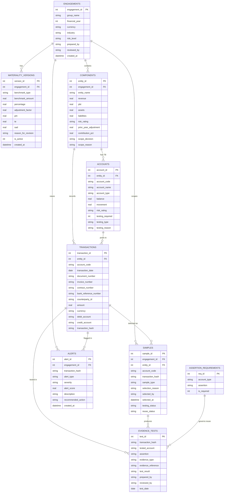

# AuditScope - Data Model (ERD)

**Database:** SQLite (V1) -> PostgreSQL (V3)
All amounts are stored as decimals; every table carries `created_at`.
`transaction_hash` is the **business key** that threads through sampling, evidence
and alerts.

---

## ERD

---

## Core tables

### 1. engagements - audit engagement
Entry point; isolates data across multiple groups.

| Field | Type | Notes |
|---|---|---|
| engagement_id | INTEGER PK | |
| group_name | TEXT | e.g. ABC Holdings Ltd |
| financial_year | INTEGER | e.g. 2026 |
| currency | TEXT | reporting currency |
| industry | TEXT | |
| risk_level | TEXT | Low / Medium / High |
| prepared_by / reviewed_by | TEXT | preparer / reviewer |
| created_at | DATETIME | |

### 2. materiality_versions - materiality (revisable)
Each recalculation writes a row; `is_active = 1` is the live version.

| Field | Type | Notes |
|---|---|---|
| version_id | INTEGER PK | |
| engagement_id | INTEGER FK | |
| benchmark_type | TEXT | PBT / Revenue / Assets / Equity |
| benchmark_amount | REAL | |
| percentage | REAL | benchmark percentage |
| adjustment_factor | REAL | |
| pm / te / sad | REAL | computed results |
| reason_for_revision | TEXT | e.g. "After audit adjustment" |
| is_active | INTEGER | whether currently live |
| created_at | DATETIME | |

### 3. components - group entities (with scope decision)

| Field | Type | Notes |
|---|---|---|
| entity_id | INTEGER PK | |
| engagement_id | INTEGER FK | |
| entity_name | TEXT | |
| revenue / pbt / assets / liabilities | REAL | entity financials |
| risk_rating | TEXT | Low / Medium / High |
| prior_year_adjustment | REAL | |
| contribution_pct | REAL | engine writeback: contribution |
| scope_decision | TEXT | Full / Specific / Analytical / Out |
| scope_reason | TEXT | engine writeback: rationale |

### 4. accounts - trial-balance accounts (with testing decision)

| Field | Type | Notes |
|---|---|---|
| account_id | INTEGER PK | |
| entity_id | INTEGER FK | |
| account_code / account_name | TEXT | |
| account_type | TEXT | Revenue / Asset / Liability / Expense / Equity |
| balance / movement | REAL | |
| risk_rating | TEXT | |
| testing_required | INTEGER | engine writeback 0/1 |
| testing_type | TEXT | Target+NSS / NSS / Specific / None |
| testing_reason | TEXT | engine writeback rationale |

### 5. transactions - transaction detail (core)
`transaction_hash` is generated by Module 6 and is the cross-table business key.

| Field | Type | Notes |
|---|---|---|
| transaction_id | INTEGER PK | row-level technical key |
| entity_id | INTEGER FK | |
| account_code | TEXT | |
| transaction_date | DATE | |
| document_number | TEXT | voucher number |
| invoice_number | TEXT | |
| contract_number | TEXT | |
| bank_reference_number | TEXT | |
| counterparty_id | TEXT | |
| amount | REAL | |
| currency | TEXT | |
| debit_account / credit_account | TEXT | |
| transaction_hash | TEXT | unique transaction ID (business key) |

### 6. samples - sampling results

| Field | Type | Notes |
|---|---|---|
| sample_id | INTEGER PK | |
| engagement_id / entity_id | INTEGER FK | |
| account_code | TEXT | |
| transaction_hash | TEXT | points to the selected transaction |
| sample_type | TEXT | Target / NSS / Reuse Candidate |
| selection_reason | TEXT | why selected |
| selected_by | TEXT | |
| selected_at | DATETIME | |
| testing_status | TEXT | Not tested / Tested |
| reuse_status | TEXT | Reusable / Partially / Not / - |

### 7. evidence_tests - test evidence (basis for reuse)
The same hash can have multiple rows (different accounts / assertions).

| Field | Type | Notes |
|---|---|---|
| test_id | INTEGER PK | |
| transaction_hash | TEXT | |
| tested_account | TEXT | account it was tested under |
| assertion | TEXT | Occurrence / Existence / Accuracy / Valuation / Cutoff / Completeness / Rights |
| evidence_type | TEXT | invoice / contract / bank slip ... |
| evidence_reference | TEXT | working-paper reference |
| test_result | TEXT | Pass / Exception |
| prepared_by / reviewed_by | TEXT | |
| test_date | DATE | |

### 8. alerts - red-flag alerts (V2)

| Field | Type | Notes |
|---|---|---|
| alert_id | INTEGER PK | |
| engagement_id | INTEGER FK | |
| transaction_hash | TEXT | related transaction (nullable; concentration is aggregate) |
| alert_type | TEXT | Duplicate Invoice / Duplicate Bank Ref / ... |
| severity | TEXT | Low / Medium / High |
| alert_score | REAL | 0-100 |
| description | TEXT | |
| recommended_action | TEXT | |
| created_at | DATETIME | |

---

## Supporting tables

### assertion_requirements - account type -> required assertions (drives reuse)
Defines which assertions each account type must cover, used by the Evidence Reuse
Tracker for the coverage comparison.

| account_type | Required assertions (example) |
|---|---|
| Revenue | Occurrence, Accuracy, Cutoff, Completeness |
| Asset (AR) | Existence, Valuation, Accuracy, Rights |
| Expense | Occurrence, Accuracy, Cutoff |
| Liability | Completeness, Valuation, Rights |

### Other tables (V3): `users`, `review_logs`, `reference_links`, `counterparty_exposure`
- `reference_links`: cross-reference graph of invoice/contract/bank references, for
  red-flag reference-chain analysis.
- `counterparty_exposure`: concentration exposure aggregated by counterparty.
- `users` / `review_logs`: RBAC and review trail.

---

## Relationship notes

- An **engagement** has many **materiality_versions** (only one active) and many
  **components**.
- A **component** has many **accounts** (TB) and many **transactions**.
- **transaction_hash** links transactions <-> samples <-> evidence_tests <->
  alerts - the **technical foundation of evidence reuse and de-duplication**.
- **assertion_requirements** is not linked to specific transactions; it provides
  the "required coverage set" per `account_type` used in the reuse assessment.
